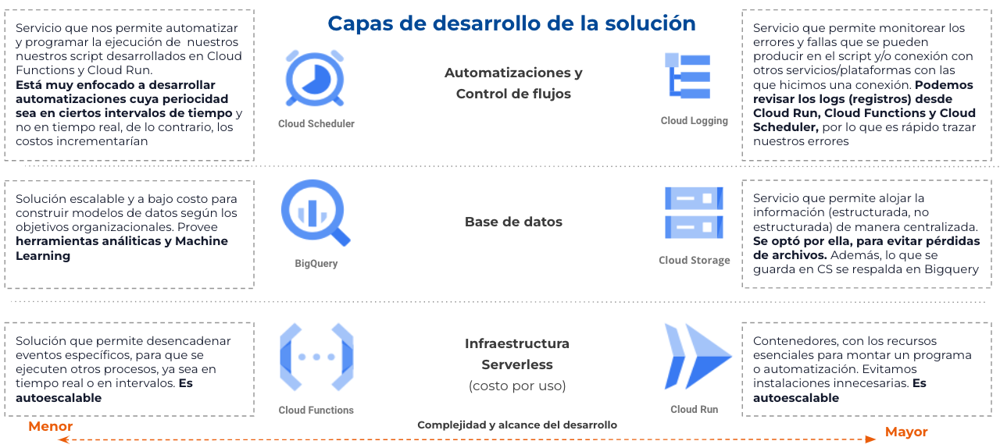
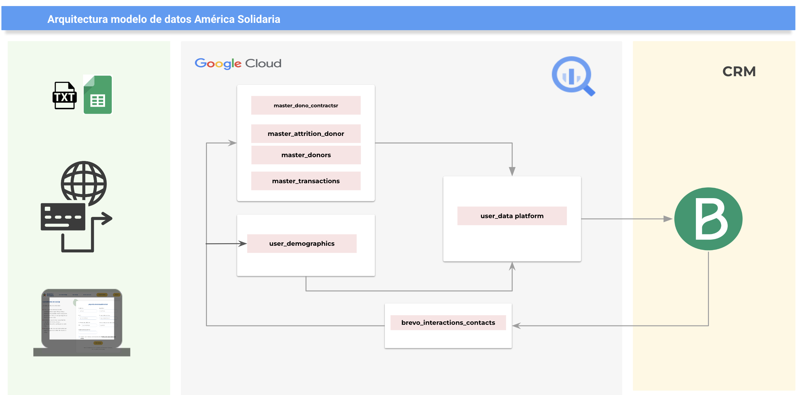

# Customer Data Platform (CDP) para América Solidaria Chile

Este repositorio contiene el código y la documentación asociada con el proyecto de construcción de un Customer Data Platform (CDP) en BigQuery para América Solidaria.

## Descripción del Proyecto

El propósito central de este proyecto consiste en centralizar y administrar eficaz y escalonadamente los datos asociados a sus socios. 

Mediante la implementación de Google BigQuery como su plataforma principal, hemos concebido un Customer Data Platform (CDP) que facilita la consolidación, análisis y visualización de información pertinente a nuestros donantes.

Con la consideración de la realidad financiera inherente a cualquier ONG, nos hemos propuesto desarrollar una solución de bajo costo. Con este fin, decidimos capitalizar las capacidades ofrecidas por servicios como BigQuery, Cloud Run y Cloud Functions de Google Cloud Platform (GCP). 

Estas opciones, caracterizadas por su agilidad de desarrollo y el modelo de costos basado en el uso, se revelan como una alternativa viable para fundaciones y empresas con presupuestos limitados. Especialmente, para aquellas que poseen la cantidad adecuada de datos para optimizar y escalar sus operaciones a través de la migración a la nube.

## Características Principales

* **Almacenamiento Eficiente:** Utilizamos Google BigQuery para almacenar grandes cantidades de datos de manera eficiente, permitiendo un rápido acceso y consultas.

* **Consolidación de Datos:** Integramos datos de diversas fuentes para crear un perfil unificado de cada socio, facilitando un enfoque holístico.

* **Análisis Avanzado:** Aprovechamos las capacidades analíticas de BigQuery para realizar análisis avanzados y descubrir patrones útiles para la toma de decisiones.

* **Visualización de Datos:** Implementamos visualizaciones interactivas utilizando **Looker Studio**, proporcionando una comprensión clara y accesible de los datos.

## Estructura del Proyecto

* **scripts/:** Contiene scripts de SQL, Python, PySpark utilizados para la creación y manipulación de tablas en BigQuery.

* **docs/:** Documentación detallada sobre la estructura de datos, los procesos y almacena respaldo con archivos de muestra y datos de prueba para facilitar la configuración inicial..

## Requisitos y Configuración
Para ejecutar este proyecto, se requiere tener una cuenta de Google Cloud Platform (GCP) con acceso a BigQuery. Asegúrese de configurar las credenciales adecuadas y de seguir las instrucciones detalladas en la documentación.

## Licencia
Este proyecto está bajo la licencia [Nombre de la Licencia]. Consulte el archivo LICENSE para obtener más detalles.

## Contacto
Para preguntas o comentarios, comuníquese conmigo a través de hola@felipeagustin.com, o bien, visita mi espacio de [Medium](https://medium.com/@f.soto.santibanez) en el que he compartido mis aprendizajes y experiencia liderando este proyecto.

